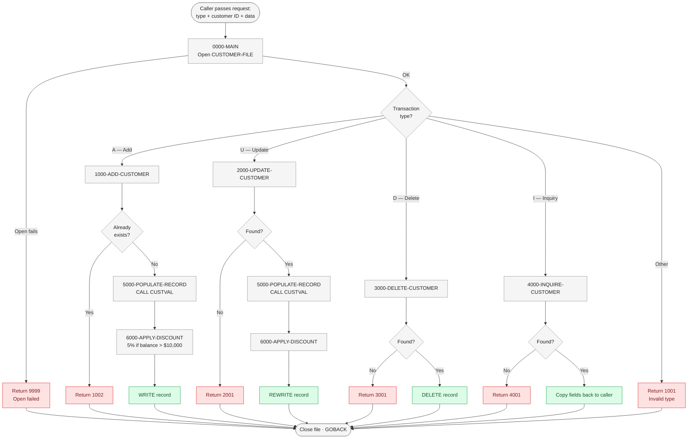
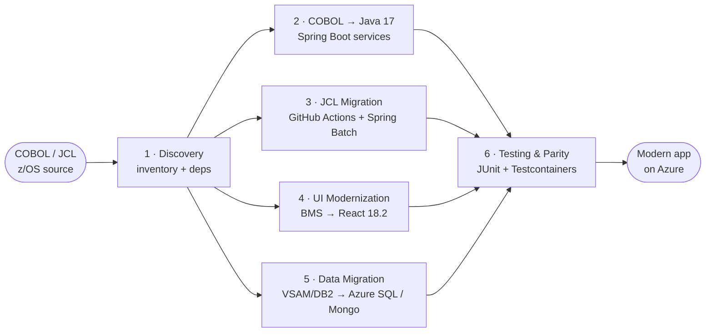

# Mainframe Modernization — GitHub Copilot Enablement Kit

> A ready-to-run toolkit for modernizing IBM z/OS COBOL applications to Java 17 + React 18.2 using the full GitHub Copilot feature set.

**Source:** z/OS 2.5 · 3.38M LOC COBOL · 937 programs · 15,250 JCL jobs &nbsp;**→**&nbsp; **Target:** Java 17 (Spring Boot) · React 18.2 (TypeScript) · Azure SQL · MongoDB

| 6 phases | 5 custom agents | 4 skills | 1 MCP server | 1 worked example |
|:-:|:-:|:-:|:-:|:-:|
| Discovery → Testing | `.github/agents/` | VS Code skills | `mainframe-context` | [`results/migration-walkthrough.html`](./results/migration-walkthrough.html) |

---

## What the migration looks like — on one program

Below is the live preview from [`results/CUSTMGMT-analysis.html`](./results/CUSTMGMT-analysis.html) recreated in GitHub-native Mermaid + Markdown: the dispatch flow of the sample COBOL program on the left, and a business-friendly walkthrough on the right.

### Process flow

> How a caller's request is routed. 🟢 = success path, 🔴 = error exits, ⬜ = routing / setup.



### What it does, in plain English

A business-friendly walkthrough of one request:

1. **A request arrives** — Another program sends a small package: *what to do* (Add / Update / Delete / Inquiry), *which customer*, and a *data payload*.
2. **Open the customer master file** — If we can't open the file, we stop immediately and report a system error.
3. **Route to the right operation** — A simple switch sends the request to Add, Update, Delete, or Inquiry. Anything else is rejected as invalid.
4. **Validate & apply business rules** — For Add and Update we call the shared `CUSTVAL` validator, then automatically apply a **5% discount** to any balance over **$10,000**.
5. **Persist or return data** — The customer record is written, updated, deleted, or read back to the caller depending on the request.
6. **Close cleanly** — The file is closed and a return code + message tell the caller exactly what happened.

> Want the full interactive version (KPIs, business rules cards, return-code parity table)? Open [`results/CUSTMGMT-analysis.html`](./results/CUSTMGMT-analysis.html) — or the end-to-end workflow in [`results/migration-walkthrough.html`](./results/migration-walkthrough.html).

---

## The migration flow at a glance



Each phase has a dedicated guide, a prompt pack, and (where useful) a custom agent + skill. The kit is opinionated so a team can pick up the same vocabulary on day one.

---

## See it work in 5 prompts

Before reading the phase guides, open the end-to-end demo — it converts `samples/cobol/CUSTMGMT.cbl` into a running Spring Boot service in 5 prompts, with every prompt and result captured in HTML for customer presentations:

- **[`results/migration-walkthrough.html`](./results/migration-walkthrough.html)** — interactive walkthrough with sticky timeline, copy-able prompts, flow diagram, file tree, and test evidence
- **[`results/CUSTMGMT-analysis.html`](./results/CUSTMGMT-analysis.html)** — business-facing analysis of the same COBOL program
- **[`services/customer-service/`](./services/customer-service/)** — the generated Spring Boot module (17 files, `mvn test` green)

> **First time here?** Read **[`QUICKSTART.md`](./QUICKSTART.md)** for the 30-minute setup of MCP, agents, and the sample module.

---

## The 6 phases as a prompt-driven journey

Every phase below follows the same pattern used in the walkthrough HTML: a goal, a canonical prompt to copy, what Copilot does with it, and where the deliverables land.

### 1 · Discovery — *understand before you touch*

> **Prompt**
> ```
> Analyze this COBOL program and provide a structured summary:
> 1. Divisions and sections
> 2. All CALL dependencies
> 3. All COPY dependencies
> 4. A plain-English summary of business logic
> ```

Copilot reads the program + copybooks via the **mainframe-context MCP server**, returns a structured inventory the team can review before any code is generated, and updates `data/program-inventory.json`.

- Phase guide: [`phases/phase-1-discovery.md`](phases/phase-1-discovery.md)
- Prompts: [`prompt-library/discovery-prompts.md`](prompt-library/discovery-prompts.md)
- Agent: [`custom-agents/cobol-analyzer.md`](custom-agents/cobol-analyzer.md) · Skill: [`custom-skills/cobol-parser-skill.md`](custom-skills/cobol-parser-skill.md)

### 2 · COBOL → Java 17 — *with parity, not just transpilation*

> **Prompt**
> ```
> Convert this COBOL program to a Java 17 Spring Boot service.
> Use BigDecimal for all decimal fields. Use Java records for DTOs.
> ```

Copilot scaffolds a full Maven module (domain, repository, service, REST, DTOs, exception handler, Flyway migration, tests). Every Java class cites the originating COBOL paragraph in Javadoc; conventions (BigDecimal, snake_case SQL, OpenAPI, package layout) come from [`.github/copilot-instructions.md`](.github/copilot-instructions.md) — no need to restate them per prompt.

- Phase guide: [`phases/phase-2-cobol-to-java.md`](phases/phase-2-cobol-to-java.md)
- Prompts: [`prompt-library/cobol-to-java-prompts.md`](prompt-library/cobol-to-java-prompts.md)
- Agent: [`custom-agents/cobol-to-java-converter.md`](custom-agents/cobol-to-java-converter.md) · Skill: [`custom-skills/copybook-mapper-skill.md`](custom-skills/copybook-mapper-skill.md)
- **Worked example:** [`services/customer-service/`](services/customer-service/)

### 3 · JCL Migration — *batch becomes a workflow*

> **Prompt**
> ```
> Convert this JCL job to a GitHub Actions workflow that orchestrates
> Spring Batch steps. Preserve step dependencies and condition codes.
> ```

JCL DD statements map to job inputs/outputs; PROC steps become Spring Batch `Step` beans; condition codes map to job-level `if:` guards in GitHub Actions.

- Phase guide: [`phases/phase-3-jcl-migration.md`](phases/phase-3-jcl-migration.md)
- Prompts: [`prompt-library/jcl-migration-prompts.md`](prompt-library/jcl-migration-prompts.md)
- Agent: [`custom-agents/jcl-migrator.md`](custom-agents/jcl-migrator.md)

### 4 · UI Modernization — *BMS to React 18.2*

> **Prompt**
> ```
> Convert this BMS screen to a React 18.2 + TypeScript page using
> Tailwind and React Hook Form. Preserve field order and validations.
> ```

BMS field attributes map to Zod schemas and `react-hook-form` registrations; PF-key handlers become button + keyboard listeners; CICS commareas become a typed `fetch` payload.

- Phase guide: [`phases/phase-4-ui-modernization.md`](phases/phase-4-ui-modernization.md)
- Prompts: [`prompt-library/react-ui-prompts.md`](prompt-library/react-ui-prompts.md)
- Agent: [`custom-agents/react-scaffolder.md`](custom-agents/react-scaffolder.md)

### 5 · Data Migration — *VSAM/DB2 to Azure SQL & MongoDB*

> **Prompt**
> ```
> Convert this VSAM file definition to an Azure SQL schema using Flyway.
> Generate the matching JPA entity and a sample data-load migration.
> ```

COMP-3 → `DECIMAL`, OCCURS → child table, 88-levels → CHECK constraints — all captured as Flyway migrations under `db/migration/V*.sql`.

- Phase guide: [`phases/phase-5-data-migration.md`](phases/phase-5-data-migration.md)
- Prompts: [`prompt-library/data-migration-prompts.md`](prompt-library/data-migration-prompts.md)
- Skill: [`custom-skills/vsam-to-sql-skill.md`](custom-skills/vsam-to-sql-skill.md)

### 6 · Testing & Parity — *prove the new code behaves like the old*

> **Prompt**
> ```
> Generate parity tests for this service: feed the same fixtures used
> by the COBOL unit tests and assert identical return codes and outputs.
> Tag them @Tag("parity").
> ```

Parity tests run alongside JUnit unit tests and TestContainers integration tests; reviewers see the same fixture pass on both sides.

- Phase guide: [`phases/phase-6-testing-validation.md`](phases/phase-6-testing-validation.md)
- Prompts: [`prompt-library/testing-prompts.md`](prompt-library/testing-prompts.md)
- Agent: [`custom-agents/migration-reviewer.md`](custom-agents/migration-reviewer.md) · Skill: [`custom-skills/test-parity-skill.md`](custom-skills/test-parity-skill.md)

---

## What's in the kit

```
mainframe-modernization/
├── README.md ◄── you are here
├── QUICKSTART.md                    # 30-minute setup
├── architecture-diagram.md          # Mermaid visuals — all phases
│
├── .github/copilot-instructions.md  # project-level Copilot policy
│
├── samples/                         # CUSTMGMT sample for hands-on
│   ├── cobol/CUSTMGMT.cbl
│   ├── cobol/CUST-REC.cpy
│   ├── jcl/CUSTBAT.jcl
│   └── bms/CUSTINQ.bms
│
├── results/                         # demo deliverables (share-ready)
│   ├── migration-walkthrough.html   #   ⭐ start here for customer demos
│   └── CUSTMGMT-analysis.html
│
├── services/customer-service/       # Spring Boot output from phase 2
│
├── data/                            # MCP metadata (from scanner)
│   ├── program-inventory.json
│   ├── copybook-catalog.json
│   ├── jcl-catalog.json
│   └── data-dictionary.json
│
├── mcp-servers/mainframe-context/   # working MCP server (Node)
├── phases/                          # phase-by-phase guides (1–6)
├── prompt-library/                  # battle-tested prompts per phase
├── custom-agents/                   # .github/agents/ definitions
├── custom-skills/                   # VS Code Agent Skills
└── copilot-config/                  # templates for copilot-instructions.md
```

---

## Copilot features used

| Feature | Where | Purpose |
|---|---|---|
| Copilot Chat | all phases | interactive understanding, conversion, Q&A |
| Copilot Edits | phases 2–5 | multi-file batch transformations |
| Coding Agent | phases 2–6 | autonomous issue → PR migration tasks |
| Custom Agents | `.github/agents/` | 5 migration personas |
| Custom Skills | VS Code | reusable COBOL parsing / mapping / testing |
| MCP Servers | `mcp-servers/` | feed program inventory + copybooks to Copilot |
| Prompt Library | `prompt-library/` | battle-tested prompts for each step |
| Copilot CLI | phases 1, 3, 6 | terminal-based analysis, JCL parsing, test runs |
| Code Review | phase 6 | automated review of migrated PRs |

---

## Prerequisites

- GitHub Copilot Business or Enterprise
- VS Code + GitHub Copilot extension (latest)
- Node.js 18+ (MCP server), Python 3.10+ (scanner)
- Java 17 SDK (Spring Boot output), Node.js 18+ for React 18.2 scaffold
- Access to your COBOL/JCL source repositories

---

## Next logical steps after the demo

These are the natural follow-ups once you've walked through `results/migration-walkthrough.html`:

- *"Now port the `CUSTVAL` COBOL program into `CustomerValidator` with parity tests."*
- *"Generate Testcontainers integration tests against Azure SQL, tagged `@parity`."*
- *"Convert `samples/jcl/CUSTBAT.jcl` to a GitHub Actions workflow + Spring Batch job."*
